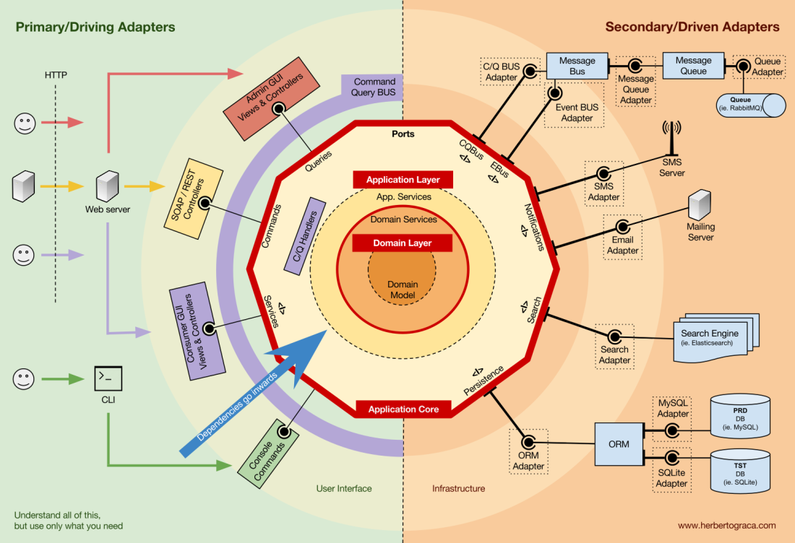
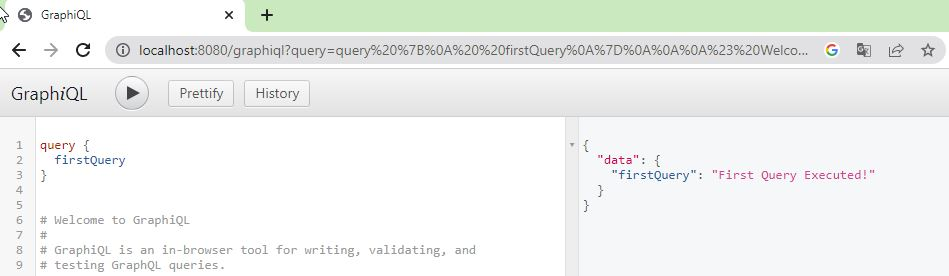
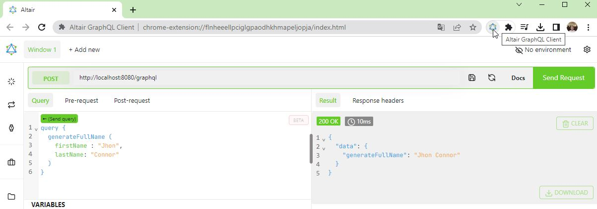
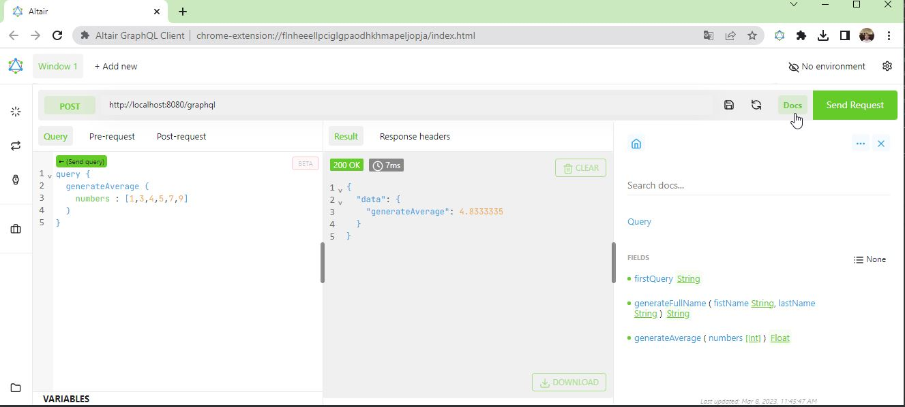

# Ejemplo de projecto Java Spring Boot con GraphQL y REST API con MongoDB empleando Arquitectura Hexagonal

Este es un ejemplo simple de cómo usar **GraphQL y REST API con Java Spring Boot** en un proyecto de **Arquitectura Hexagonal** empleando 
diferentes dependencias tales como lombok, graphql, mongodb, spqr entre otras.

[](https://herbertograca.com/2017/11/16/explicit-architecture-01-ddd-hexagonal-onion-clean-cqrs-how-i-put-it-all-together)

La arquitectura hexagonal es un patrón arquitectónico que tiene como objetivo hacer que los sistemas de software sean 
más flexibles, mantenibles y comprobables. En este patrón, el sistema se divide en tres capas principales: 
Dominio, Aplicación e Infraestructura, cada una de las cuales se intercomunica a través de adaptadores y puertos de entrada y salida.  

En este tipo de arquitectura se parte desde el dominio. A continuación se describe brevemente cada capa:  
**Capa de Dominio:** Contiene las entidades, los value objects, las proyecciones, servicios de dominio
La capa de dominio es usada por la capa de aplicación.  
**Capa de Aplicación:** Contiene los casos de uso o servicios de aplicación.  
**Capa de Infraestructura:** Contiene los controladores, adaptadores y puertos.  

Hay que tener en cuenta también que la arquitectura hexagonal también consta de dos lados a saber:
**el driving side o lado conductor o lado primario** y **el secondary side o lado secundario**.
Para tener una idea más clara de su interacción observe el diagrama: 
[![Flujo entre primary side y secondary side en arquitectura hexagonal][Flujo entre primary side y secondary side en arquitectura hexagonal]](https://www.youtube.com/watch?v=CycNkSXfXy8)

En el **Primary/Driving Side el flujo sera** de la siguiente manera:  
* El Input Adapter hace uso del Input Port
* El Input Port será implementado por el Caso de Uso (Aplicación)
 
y desde el **Secondary/Driven Side tenemos** que:  
* El Caso de Uso (Aplicación) hace uso del Output Port
* El Output Port debe ser implementado por el Output Adapter.

La idea fundamental detrás de la arquitectura hexagonal es que el lado conductor, o la capa de aplicación: no depende de ninguna tecnología o
detalle de implementación específicos.
En cambio, el lado secundario se encarga de adaptar esas tecnologías y detalles específicos a los puertos definidos en el lado conductor.
Esto facilita el intercambio y la evolución de las implementaciones en el lado secundario sin afectar la lógica de negocio en el lado conductor.


# GraphQL and REST API with Java Spring Boot Example using Hexagonal Architecture
This is a simple example of how to use GraphQL with Spring Boot Java in a Hexagonal Architecture project using 
different dependencies such as lombok, graphql, mongodb, spqr and others. The code source of this project is 
based on content of diferent sources and courses that it referenced on Information Sources section.

Hexagonal architecture is an architectural pattern that aims to make software systems
more flexible, maintainable and verifiable. In this pattern, the system is divided into three main layers:
Domain, Application and Infrastructure, each of which intercommunicates through adapters and input and output ports.

In this type of architecture, it starts from the domain. Each layer is briefly described below:
**Domain Layer:** Contains entities, value objects, projections, domain services
The domain layer is used by the application layer.
**Application Layer:** Contains the use cases or application services.
**Infrastructure Layer:** Contains drivers, adapters and ports.

It must also be taken into account that the hexagonal architecture also consists of two sides namely:
**the driving side or primary side** and **the secondary side or secondary side**.
To get a clearer idea of their interaction, look at the diagram:

In the **Primary/Driving Side the flow will be** as follows:
* The Input Adapter makes use of the Input Port
* The Input Port will be implemented by the Use Case (Application)

and from the **Secondary/Driven Side we have** that:
* The Use Case (Application) makes use of the Output Port
* The Output Port must be implemented by the Output Adapter.

The fundamental idea behind the hexagonal architecture is that the driving side, or application layer: does not depend on any technology or
specific implementation detail.
Instead, the secondary side is responsible for adapting those specific technologies and details to the ports defined on the driver side.
This makes it easy to swap and evolve implementations on the child side without affecting the business logic on the driver side.


### Requirements to deploy ###
- [Zulu JDK 11 Azure](https://docs.microsoft.com/en-us/azure/developer/java/fundamentals/java-jdk-install).
- [Maven 3](https://maven.apache.org/download.cgi).
- [Altair GraphQL Client](https://chrome.google.com/webstore/search/altair%20graphql%20client?hl=es-419). (Optional)
- [MongoDB](https://www.mongodb.com/)
- [Studio 3T](https://studio3t.com/). (To view data saved in collections of the database Mongo)
- [Postman](https://www.postman.com/). (To generate the requests & responses GraphQL and REST towards API endpoints of application)

## How to run this project
- Clone this repository
- From the terminal, go to the project folder and run the following command:
```bash
mvn clean
mvn compile
mvn spring-boot:run
```

## How to test queries of this project?
### Using the GraphiQL
- Once the project is Run then Open your browser and go to the following URL:  
[http://localhost:8080/graphiql](http://localhost:8080/graphiql)

### Using the Altair GraphQL Client
- First install the [Altair GraphQL Client](https://chrome.google.com/webstore/search/altair%20graphql%20client?hl=es-419) from the Chrome Web Store
![Altair GraphQL Chrome Extention][Altair GraphQL Extention] <br /><br />
- then Run this project on IntelliJ IDE and Open in your Chrome browser the Altair GraphQL Client, set the project URL in this case http://localhost:8080/graphql type your query and click on the play button "Send Request" to execute it.
![Altair GraphQL Client][Altair GraphQL Client]
 
[Altair GraphQL Extention]: src/main/resources/media/doc/AltairChromeExtension.jpg
[Altair GraphQL Client]: src/main/resources/media/doc/AltairGraphQLClient_Run.jpg
[Flujo entre primary side y secondary side en arquitectura hexagonal]: src/main/resources/media/doc/ArqHexagonal/ArquitecturaHexagonal_Elementos.png

## List of GraphQL queries
You can type the following query and click on the play button to execute it:
- Query with no input data on request:
```graphql
 query {   
   firstQuery  
 }
```


- Query with input data on request:
```graphql
query {
  generateFullName(
    firstName: "John", 
    lastName: "Connor"
    )
}
```


- Query with array input of integers data on request and float result:
```graphql
query {
  generateAverage (
    numbers : [1,3,4,5,7,9]
  )
}
```



## CRUD operations on MongoDB
This project integrate some basic endpoints to Create, Read/Get, Update and Delete data on non-relational database like MongoDB.
Take in count that following commands must be executed on terminal once the project and MongoDB has run.


### Using the Postman Client  
- Command terminal to create a Customer:
```curl
curl --location --request POST 'http://localhost:8080/api/customer/add' \
--header 'Content-Type: application/json' \
--data-raw '{
    "id":1,
    "email": "maxbush@mail.com",
    "name": "Maximiliano",
    "lastName": "Busheli"
}'
```

- Command terminal to update a Customer:
```curl
curl --location --request POST 'http://localhost:8080/api/customer/update' \
--header 'Content-Type: application/json' \
--data-raw '{
"id":2,
"email": "jgo@mail.com",
"name": "Julian",
"lastName": "Garcia"
}'
```

- Command to get/find a Customer:
```curl
curl --location --request GET 'http://localhost:8080/api/customer/find/2'
```

- Command to find all Customers:
```curl
curl --location --request GET 'http://localhost:8080/api/customer/findAll'
```

- Command to delete a Customer:
```curl
curl --location --request DELETE 'http://localhost:8080/api/customer/delete/1'
```

## Information Sources:
This content of this project is based on the following web resources:  
>[GraphQL API with Java Spring Boot & Spring Framework](https://www.udemy.com/course/graphql-with-java-spring-boot-query-mutation-schema-resolver-edge-jpa)
[Implementación de arquitecturas hexagonales - NullSafe Architecture youtube channel](https://www.youtube.com/watch?v=CycNkSXfXy8)  
[Java Spring Boot Hexagonal Architecture Sample - Albert Coronado (GitHub repo)](https://github.com/acoronadoc/java-springboot-hexagonal-architecture-sample) <br />
[Arquitectura Hexagonal](https://herbertograca.com/2017/11/16/explicit-architecture-01-ddd-hexagonal-onion-clean-cqrs-how-i-put-it-all-together)
[Spring Boot Common Application Properties](https://docs.spring.io/spring-boot/docs/current/reference/html/application-properties.html#appendix.application-properties.data-migration) <br />
[Lombok and JPA: What may go wrong?](https://www.jpa-buddy.com/blog/lombok-and-jpa-what-may-go-wrong/) <br />
[ How to find where one lib is imported to the project in IntellijIdea?](https://intellij-support.jetbrains.com/hc/en-us/community/posts/360003503580-How-to-find-where-one-lib-is-imported-to-the-project-in-IntellijIdea-) <br />
[Spring Boot With MongoDB CRUD Example - Java Techie](https://www.youtube.com/watch?v=k5PeywcbVYc) <br />
[How to intigrate spring boot with mongodb - Java Techie (GitHub repo)](https://github.com/Java-Techie-jt/spring-mongodb) <br />
[Simulate a specific CURL in PostMan](https://stackoverflow.com/questions/27957943/simulate-a-specific-curl-in-postman) <br />
[Markdown getting started](https://www.markdownguide.org/getting-started/)

&#9749; and Good look!
